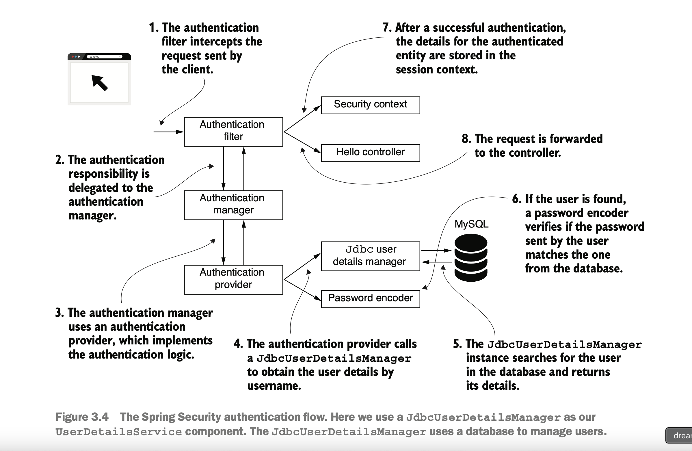

# Points learned

### continue-Basic Authentication

Besides the InMemoryUserDetailsManager, we often use another UserDetailManager
implementation, JdbcUserDetailsManager. The JdbcUserDetailsManager
class manages users in an SQL database. It connects to the database directly through
JDBC.

* InMemoryUserDetailsManager, JdbcUserDetailsManager and Other interfaces of UserDetailsManager extends from
  UserDetailsManager.
* UserDetailsManager is also extending UserDetailsService with additional features (create, update, delete a user and
  update the password, etc.) .
* The UserDetailsManager interface looks like following:

```java 
public interface UserDetailsManager extends UserDetailsService {
    void createUser(UserDetails user);

    void updateUser(UserDetails user);

    void deleteUser(String username);

    void changePassword(String oldPassword, String newPassword);

    boolean userExists(String username);
}
```

#### Following is Spring boot architecture , and where JSBCUserDetailsManager fits in the Architecture.

